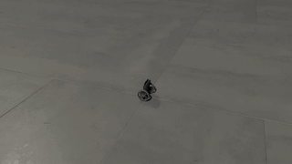
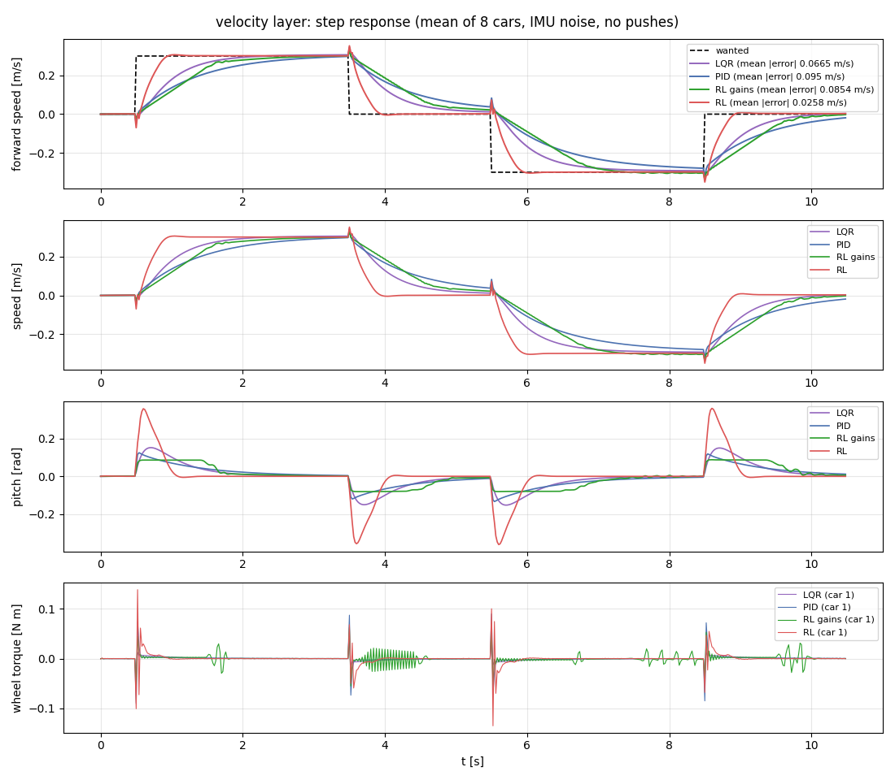
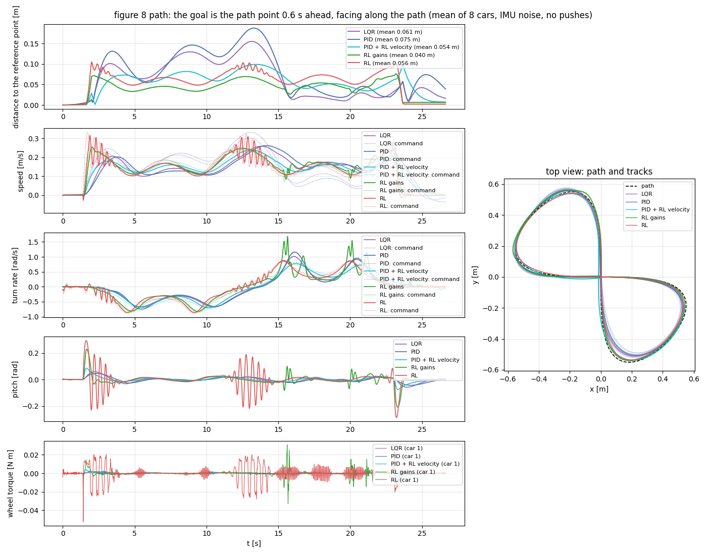

# Self-Balancing Robot RL

A two-wheeled self-balancing robot (Pololu Balboa 32U4) trained with reinforcement learning in **Isaac Lab 3.0**, deployable
through **ROS 2**. Trained weights are included.

<p align="center">
  
</p>
<p align="center"><sub>A figure 8 driven by the frozen velocity policy and a go-to-goal PID whose gains a policy sets (3× speed)</sub></p>

## Quick start

```bash
# Isaac Sim 6.1 + Isaac Lab 3.0 (Linux, NVIDIA GPU, Python 3.12)
conda create -n env_isaaclab python=3.12 -y && conda activate env_isaaclab
pip install "isaacsim[all,extscache]==6.1.0" --extra-index-url https://pypi.nvidia.com
git clone https://github.com/isaac-sim/IsaacLab.git && (cd IsaacLab && ./isaaclab.sh -i)

# this repo (weights in Git LFS)
git lfs install
git clone https://github.com/vohongquann/Self_Balancing_Robot_RL.git && cd Self_Balancing_Robot_RL
pip install -e . --no-deps && pip install scipy onnx onnxruntime

# run a trained policy, recorded to videos/demo/
python src/Balance_Car_RL/car/tools/record_demo.py --cascade position_gains   # or: position, rl, gains, lqr, lqr_position
```

## Trained policies

All policies are evaluated on 768 episodes with pushes, IMU noise and a randomized robot. None of them fell.

| Policy | Task | Median error | Weights |
|---|---|---|---|
| Velocity | `BalanceCar-Velocity-v0` | 0.021 m/s, 0.055 rad/s | [frozen/velocity](src/Balance_Car_RL/car/rl_control/frozen/velocity) |
| Position | `BalanceCar-Position-v0` | 8 mm, 0.012 rad | [frozen/position](src/Balance_Car_RL/car/rl_control/frozen/position) |
| Position gains | `BalanceCar-Position-Gains-v0` | 12 mm, 0.095 rad | [frozen/position_gains](src/Balance_Car_RL/car/rl_control/frozen/position_gains) |
| Pitch gains | `BalanceCar-Pitch-Gains-v0` | 0.0092 rad | [frozen/pitch_gains](src/Balance_Car_RL/car/rl_control/frozen/pitch_gains) |
| Velocity gains | `BalanceCar-Velocity-Gains-v0` | 0.021 m/s | [frozen/velocity_gains](src/Balance_Car_RL/car/rl_control/frozen/velocity_gains) |
| Upright | `BalanceCar-Upright-v0` | 0.019 rad RMS | [models/](models/balance_car_policy.onnx) |

Position runs on top of the frozen velocity policy. The *gains* policies tune a PID instead of outputting torques.

## RL vs LQR vs PID

| | LQR | PID | RL gains | RL |
|---|---|---|---|---|
| Speed step: error / settling | 0.067 m/s / 1.1 s | 0.095 m/s / 2.0 s | 0.085 m/s / 1.4 s | **0.026 m/s / 0.36 s** |
| Reach a goal: distance error | 13–50 mm | 19–45 mm | 2–14 mm | **2–6 mm** |
| Figure 8: median distance | 0.050 m | 0.062 m | **0.043 m** | 0.062 m |

<p align="center">
  
  
</p>

## Train

```bash
python scripts/train_cascade.py                                  # velocity -> position (~1 h, ~10 GB VRAM)
isaaclab train --rl_library rsl_rl --task BalanceCar-Upright-v0 --num_envs 4096
python scripts/evaluate.py --task BalanceCar-Position-v0 --controller lqr  # or pid; Upright, Velocity; or --checkpoint
```

## ROS 2

```bash
source /opt/ros/jazzy/setup.bash
F=src/Balance_Car_RL/car/rl_control/frozen
PYTHONPATH=ros/src/car_bridge python -m car_bridge.bridge_node --ros-args -p controller:=position \
    -p velocity_path:=$F/velocity/policy.onnx -p position_path:=$F/position/policy.onnx
```

Subscribes to `imu` and `joint_states`, plus `cmd_vel` or `goal_pose`. Publishes `wheel_torque_cmd` and `odom`.
Without networks: `controller:=lqr_velocity` or `lqr_position` (LQR balance, PID turn and go-to-goal).

## Tests

```bash
PYTHONPATH=ros/src/car_bridge python -m pytest tests ros/src/car_bridge/test/test_policy.py ros/src/car_bridge/test/test_estimator.py -q
```

## Status

Simulation only: not yet tested on the real robot. Masses and motor inertia are estimates.

Built on [Isaac Lab](https://github.com/isaac-sim/IsaacLab) · datasheets in [docs/](docs/readme.md) · [LICENSE](LICENSE)
