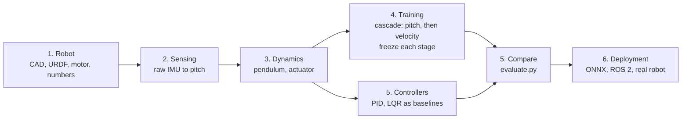
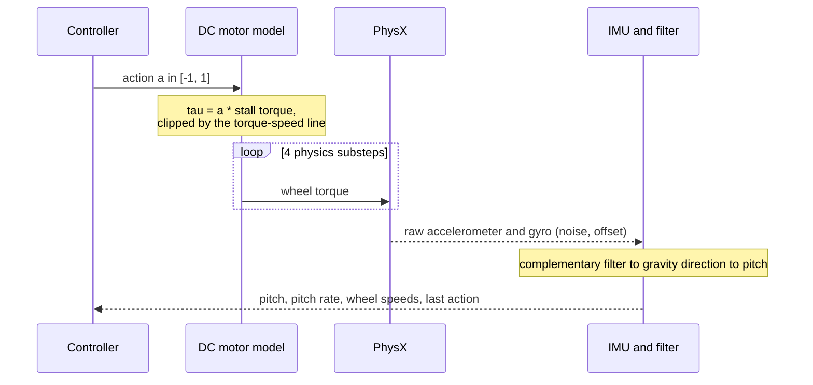

# Overview

Two-wheeled self-balancing robot (Pololu Balboa 32U4) in Isaac Lab. A controller keeps it upright and, in the last stage,
drives it at a commanded speed. This page is the map; each step of the flow has its own page.

## The flow



| Step | Page | Question it answers |
|---|---|---|
| 1 | [01-robot.md](01-robot.md) | What is the robot, where does each number come from, how do I measure the real one? |
| 2 | [02-sensing.md](02-sensing.md) | What does the controller see? How does a raw IMU become the pitch the policy uses? |
| 3 | [03-dynamics.md](03-dynamics.md) | How does the robot move? What can the motors do? |
| 4 | [04-training.md](04-training.md) | How is the RL policy trained: tasks, reward, cascade stages, frozen weights, video? |
| 5 | [05-controllers.md](05-controllers.md) | How do PID, LQR and the RL policy compare, and how do I tune each? |
| 6 | [06-deployment.md](06-deployment.md) | How does a trained policy run on ROS 2 and on the real robot? What is still untested? |

## One control step (50 Hz over 200 Hz physics)



## Repository layout

```text
Balance_Car_RL/
├── src/Balance_Car_RL/
│   ├── assets/data/balboa/     balboa.urdf, imu_mount.json, meshes/*.stl (generated, committed)
│   ├── tasks/__init__.py       imports car/ (gym registration runs there)
│   └── car/                    the robot domain
│       ├── car_cfg.py          every physical constant with its source, CAR_CFG
│       ├── estimation.py       IMU to gravity direction (torch)
│       ├── mdp/                observations, commands, actions, rewards
│       ├── rl_control/         RL: common.py, three env configs, agents/, frozen/ (frozen stage weights)
│       ├── pid_control/        PID baseline
│       ├── lqr_control/        LQR baseline and the linear plant
│       └── tools/              plot_training.py
├── scripts/                    train_cascade.py, evaluate.py
├── tools/                      build_balboa_urdf.py, fetch_pololu_cad.sh
├── ros/src/car_bridge/         ROS 2 node
├── models/                     ONNX policy for ROS (upright baseline)
├── tests/                      no simulator needed
├── docs/                       this documentation
└── cad/                        CAD, datasheets, drawings (git-ignored)
```

## Which command for which question

| Question | Command |
|---|---|
| Do constants, URDF and ROS scale agree? | `python -m pytest tests` |
| Train and freeze the whole cascade, with video | `python scripts/train_cascade.py` |
| Train one task by hand | `isaaclab train --rl_library rsl_rl --task BalanceCar-Pitch-v0` |
| How well does a controller work (numbers)? | `python scripts/evaluate.py --task <task> [--controller lqr\|pid] [--checkpoint <model.pt>]` |
| What does it look like? | `isaaclab play --rl_library rsl_rl --task <task> --num_envs 4 --viz kit` |
| Rebuild the model after a CAD or mass change | `python tools/build_balboa_urdf.py` |
