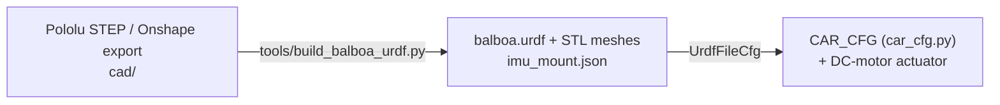

# 1. Robot

The Pololu Balboa 32U4: two 80 mm wheels, a chassis with a control board (IMU, encoders), six AA cells, and two micro metal
gearmotors. This page lists the robot, where every number in the simulation comes from, and how to measure the real one.
Code: [car_cfg.py](../src/Balance_Car_RL/car/car_cfg.py) holds every constant; [tools/build_balboa_urdf.py](../tools/build_balboa_urdf.py)
builds the geometry; the result is [balboa.urdf](../src/Balance_Car_RL/assets/data/balboa/balboa.urdf).

## 1.1 From CAD to URDF

The Onshape export cannot be used as is (Isaac Sim 6.1 imports it as a robot with no geometry: glTF meshes, no mass on the
base, two meshes shifted by 19.86 mm). The script therefore:

1. rotates the model about the axle until the centre of mass is straight above it (the CAD is modelled tilted, by 80°);
2. gives the parts mass (`BASE_MASS_KG`, `WHEEL_MASS_KG` from `car_cfg.py`) spread over the CAD volumes, and inertia from the
   convex hull of each part;
3. makes both wheel axes point along +y, so equal positive joint speeds drive straight forward;
4. converts glTF to decimated STL and uses boxes and cylinders for collision;
5. writes `imu_mount.json`: pose of the IMU (control board axes) in the car frame, used by [02-sensing.md](02-sensing.md).

Frame: x forward, y left, z up, origin on the axle. Import `balboa.urdf`, not the raw Onshape URDF.
`tools/fetch_pololu_cad.sh` downloads the official STEP files, drawings and the IMU datasheet into `cad/balboa/`.

## 1.2 Published numbers

"Pololu" is the [Balboa 32U4 product page](https://www.pololu.com/product/3575) and [user's guide](https://www.pololu.com/docs/0J70).

| Quantity | Value | Source |
|---|---|---|
| Wheel | 80 mm diameter, 11.8 mm wide (70 and 90 mm also fit) | user's guide, kit drawing, CAD |
| Track (joint to joint) | 107 mm | CAD, joints at ±53.5 mm |
| Gearmotor | 50:1 HPCB 6 V micro metal, 12 CPR encoder on the motor shaft | user's guide (30:1, 75:1 also recommended) |
| Gearmotor exact ratio | 3344/65 = 51.45 | gear ratio chart |
| External gearbox | 49:17 (2.88:1), one of five from 1.64:1 to 2.88:1 | gear ratio chart |
| Total ratio | 148.3:1 | chart |
| Stall torque, stall current | 0.74 kg cm (10 oz in), 1.5 A at 6 V | HPCB 6 V comparison table |
| No-load speed, current | 650 rpm, 150 mA | same table |
| Encoder | about 1778 counts per wheel revolution | user's guide |
| Battery | 6 AA cells: 7.2 V (NiMH) or 9 V (alkaline); board limit 10.8 V | user's guide |
| IMU | ST LSM6DS33: rate noise 7 mdps/√Hz, acceleration noise 90 µg/√Hz (FS ±2 g, ODR 104 Hz), typical zero-g offset ±40 mg, zero-rate level ±10 dps | LSM6DS33 datasheet, Table 3 |
| Ground clearance, chassis tilted | as small as 7 mm | kit drawing, note 2 |

## 1.3 Constants derived in `car_cfg.py`

| Constant | Formula | Value |
|---|---|---|
| `WHEEL_RADIUS_M` | 80 mm / 2 | 0.040 m |
| `TOTAL_RATIO` | 3344/65 x 49/17 | 148.3 |
| `WHEEL_STALL_TORQUE_NM` | 0.74 x 0.0980665 x 49/17 | 0.209 N m |
| `WHEEL_NO_LOAD_SPEED_RAD_S` | 650 rpm x 2π/60 x 17/49 | 23.6 rad/s |
| `WHEEL_ARMATURE` | `MOTOR_ROTOR_INERTIA` x `TOTAL_RATIO`² | 1.54e-4 kg m² per wheel |

## 1.4 Geometry from the CAD

| Quantity | Value |
|---|---|
| COM height above the axle | 19.9 mm (from the assumed mass split) |
| Parts (bounding boxes) | chassis 107.0 x 104.1 x 47.4 mm; board 69.1 x 109.2 x 9.6 mm; battery cover 59.7 x 103.1 x 20.8 mm |
| Lowest body point | 29.2 mm below the axle: 10.8 mm above the ground |
| Base inertia about its COM | Ixx 3.3e-4, Iyy 2.2e-4, Izz 1.9e-4 kg m² (CAD hull, uniform density) |
| Wheel spin inertia | 1.55e-5 kg m² |
| IMU position | centre of the control board, 25.8 mm above the axle |

## 1.5 Assumptions (not published)

| Assumption | Value used | Why it matters |
|---|---|---|
| Body mass (chassis, board, 6 AA, 2 gearmotors) | 0.27 kg | Pendulum dynamics and COM height |
| Wheel mass with hub | 0.020 kg each | Wheel inertia |
| Mass distribution | uniform over the CAD volumes | The COM moves several mm if the batteries (heaviest part) sit elsewhere |
| Motor rotor inertia | 7e-9 kg m² (about 1.5 g, 6 mm) | Reflected through 148:1 it is as large as the body inertia: the unstable pole is 9.2 rad/s with it, 14.9 without |
| Gearbox efficiency, friction, backlash | 100 %, none | Real wheel torque is lower; static friction adds a dead zone |
| Motor voltage | 6 V rating | The Balboa supplies 7.2 to 9 V (more speed and torque); battery sag lowers it |
| Motor electrical dynamics, driver | ideal torque with a torque-speed limit | Real current control lags a few ms |
| Tyre friction and compliance | Isaac Sim default material | Slip, rolling resistance |
| IMU position and axes | centre of the board; axes = board axes; mounting known exactly | A wrong rotation gives a wrong pitch sign or offset |
| IMU residual offsets | 10 % of the datasheet zero-g and zero-rate levels | The real residual depends on your calibration |
| IMU vibration, latency | none | Motor vibration adds noise; the filter and bus add delay |
| Encoders | perfect: no noise, no quantization, no latency | One count is 0.18 rad/s at 50 Hz |
| Control loop | 50 Hz policy, 200 Hz physics | Real firmware rate and jitter not measured |

## 1.6 Measuring the real robot

Measure the first rows, edit `car_cfg.py`, run `python tools/build_balboa_urdf.py`, rerun `design_lqr()` and retrain.

| Quantity | How | Compare with |
|---|---|---|
| Mass | Weigh the robot with the batteries you will run (NiMH and alkaline differ by 20 to 30 g), then each wheel with its hub. Body = total - 2 x wheel | 0.27 kg, 0.020 kg |
| COM height $L$ | Balance the robot upright on a rod parallel to the axle; $L$ = axle to rod distance | 19.9 mm (a gap above a few mm means the mass split is wrong, usually the batteries) |
| Body inertia | Hang it by the axle as a pendulum, time 20 swings for the period $T$: $I_{axle}=mgLT^2/4\pi^2$, $I_{cm}=I_{axle}-mL^2$ | 2.2e-4 kg m² |
| No-load speed | Bench supply at your voltage, count encoder ticks per second with the wheel free | 225 rpm (23.6 rad/s) at 6 V |
| Stall torque | Hold the wheel with a lever of length $r$ on a scale, briefly (about 1.5 A): $\tau=Fr$ | 0.209 N m at 6 V |
| IMU noise and offsets | Leave the robot still for 60 s; record mean and standard deviation of gyro and accelerometer | `IMU_*_NOISE_STD`, `IMU_*_BIAS_MAX` in `car_cfg.py` |
| IMU mounting | Tilt the robot forward 10° by hand; the estimated pitch must be about +0.17 rad; otherwise fix the rotation | `imu_mount.json`, `R_CAR_FROM_IMU` in `estimator.py` |
| Latency | Toggle a motor command, measure the delay until the encoder responds; above 5 ms add it to the actuator model | not modelled |

After changing `WHEEL_STALL_TORQUE_NM`, update `TORQUE_SCALE_NM` in `ros/src/car_bridge/car_bridge/policy.py`; a test checks that
they agree.
