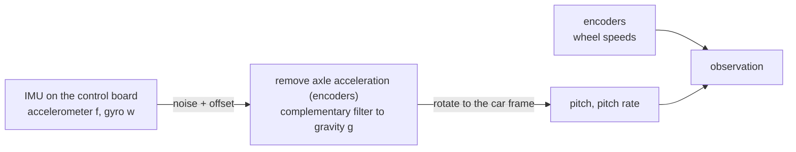

# 2. Sensing

The controller sees what the real robot can measure: a raw IMU and wheel encoders. There is no access to the simulator state,
so a policy trained here meets the same kind of signal on the robot. Code: [mdp/observations.py](../src/Balance_Car_RL/car/mdp/observations.py)
(`ImuPitchAndRate`), [estimation.py](../src/Balance_Car_RL/car/estimation.py) (filter, torch) and
[car_bridge/estimator.py](../ros/src/car_bridge/car_bridge/estimator.py) (the same filter, numpy, for ROS).

## 2.1 What the IMU measures

Six numbers in the IMU frame (the control board axes, tilted with the chassis; a fixed rotation $R$ brings them to the car frame,
$v_{car}=R\,v_{imu}$, `IMU_R_CAR_FROM_IMU`): the gyro $\omega$ [rad/s] and the accelerometer, which reads the *specific force*
$f$. At rest $f$ is minus gravity: a flat IMU reads +1 g on z.

$$\tilde\omega=\omega+b_\omega+n_\omega,\qquad \tilde f=f+b_f+n_f$$

| Term | Value | Source |
|---|---|---|
| Noise $n$ per sample | 6.4e-3 m/s² (accel), 8.8e-4 rad/s (gyro) | LSM6DS33: 90 µg/√Hz and 7 mdps/√Hz times √52 Hz |
| Offset $b$, uniform per episode | ±0.039 m/s² (accel), ±0.0175 rad/s (gyro) | 10 % of the datasheet ±40 mg and ±10 dps: assumed residual after a start-up calibration |

Flat on a table (illustrative numbers): $a=(+0.01,-0.02,+1.00)$ g, $\omega=(0.3,-0.5,0.2)$ °/s. The gyro never reads exactly zero at rest.

## 2.2 Removing the robot's own acceleration

The accelerometer cannot tell gravity from the robot's own acceleration, and this robot accelerates all the time: a forward
acceleration $a$ adds $a$ to the forward reading, which looks like a backward tilt of $a/g$ (0.5 m/s² reads as 0.05 rad). Left
uncorrected, the estimate is biased whenever the robot drives, and a policy that trusts it leans more, accelerates more, and runs away.
The encoders give the axle speed, so its acceleration is known and is subtracted from the reading (`estimation.py`,
`compensate_acceleration`):

$$v=r\big(\tfrac12(\dot q_L+\dot q_R)+\dot\theta\big),\qquad a_k=\alpha_a a_{k-1}+(1-\alpha_a)\frac{v_k-v_{k-1}}{\Delta t},\qquad
\tilde f\leftarrow\tilde f-a_k\,R_{0,:},\qquad \alpha_a=\frac{\tau_a}{\tau_a+\Delta t},\ \tau_a=0.05\ \text{s}$$

$R_{0,:}$ is the car forward axis written in the IMU frame. The difference of the speed is noisy, hence the low-pass. On the real robot
the encoders resolve 0.007 m/s per count at 50 Hz, i.e. 0.35 m/s² per count of acceleration before the low-pass; the simulation has perfect
encoders. What stays uncorrected is the pitch acceleration acting on the IMU, which sits 26 mm above the axle
(50 rad/s² adds 1.3 m/s²).

## 2.3 Gravity direction

Projected gravity $g_b$ is the unit vector of gravity in the sensor frame. No sensor measures it directly: an accelerometer cannot
tell gravity from the robot's own acceleration, so it is estimated from both sensors.

- Accelerometer alone, valid at rest: $g_b=-\tilde f/\lVert\tilde f\rVert$. It is noisy and wrong while the robot accelerates.
- Gyro alone: the world is fixed and the body turns, so $\dot g_b=-\omega\times g_b$. It is smooth but drifts.
- A complementary filter blends them once per control step ($\Delta t=0.02$ s):

$$g^-=g_{k-1}-(\tilde\omega\times g_{k-1})\,\Delta t,\qquad
g_k=\frac{\alpha\,g^-+(1-\alpha)\,\big(-\tilde f/\lVert\tilde f\rVert\big)}{\lVert\cdot\rVert},\qquad
\alpha=\frac{\tau}{\tau+\Delta t}=0.98,\ \tau=1\ \text{s}$$

The gyro dominates fast motion; the accelerometer slowly pulls the estimate back. In the simulation the estimate is seeded from the
simulator's true gravity direction at every reset and keeps filtering from there (a reset can start mid-fall, so restarting from one
noisy accelerometer sample would throw away state the simulator already knows exactly). The real robot has no such truth to seed
from, so `estimator.py`'s filter starts cold, from the accelerometer alone, as the robot does at power-up (it must start at rest).
Writing $\alpha$ through $\tau$ keeps simulation and robot equal at any rate once both are running.

## 2.4 Pitch and observation

In the car frame ($g_c=Rg_k$, $\omega_c=R\tilde\omega$):

$$\theta=\operatorname{atan2}(g_{c,x},\,-g_{c,z}),\qquad \dot\theta=\omega_{c,y}$$

Pitch is positive when the robot leans forward. It is continuous, independent of yaw and of the quaternion convention, and needs no
magnetometer. Roll and yaw are not used: the robot cannot balance about the other axes, and yaw is unobservable without a magnetometer.

Observation of the upright and pitch tasks ([04-training.md](04-training.md) lists all three tasks):

| Index | Term | Source |
|---|---|---|
| 0, 1 | pitch, pitch rate | IMU and filter (above) |
| 2, 3 | left, right wheel speed [rad/s] | encoders, relative to the body |
| 4, 5 | previous action | controller memory |
| 6 | pitch target (pitch task only) | command |

The controllers need the **absolute** wheel speed, which the encoders do not give (they measure against the body):
$\dot\psi=\tfrac12(\dot q_L+\dot q_R)+\dot\theta$, and the forward speed of the axle is $v=r\dot\psi$.

## 2.5 Where the estimate goes wrong

| Effect | Size | Why |
|---|---|---|
| Gyro offset $b$ | about $b\,\tau$ = 0.017 rad for the largest offset | the filter only corrects at rate $1/\tau$ |
| Pitch acceleration in the accelerometer (the axle acceleration is removed, §2.2) | 1.3 m/s² for 50 rad/s² (IMU 26 mm above the axle) | it adds $\ddot\theta\,h$ to $f$: 0.13 rad error in $g_b$ before averaging |
| Larger $\tau$ | less acceleration error, more drift | trusts the gyro longer |

`scripts/evaluate.py` prints the RMS error of the estimate against the simulator's true pitch; see
[04-training.md](04-training.md) §4.7, or `rl_control/frozen/<stage>/meta.json`, for the number of the currently trained policy.

## 2.6 Numbers at rest

| Car pitch | Accelerometer in the car frame $(f_x, f_z)$ | $g_c$ | $\theta$ |
|---|---|---|---|
| 0 (flat) | (0, +1 g) | (0, -1) | 0 |
| +10° forward | (-0.174 g, +0.985 g) | (0.174, -0.985) | +0.1745 rad |

`tests/test_estimation.py` checks that the torch and numpy filters agree and that the pitch sign is right.

## 2.7 Not modelled

Encoder noise and quantization (which limit the acceleration compensation of §2.2 on the real robot), sensor latency, motor vibration in the IMU, and any mismatch between the assumed and the real
IMU mounting ([01-robot.md](01-robot.md) §1.5).
