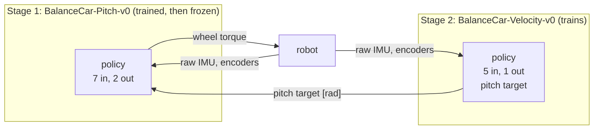
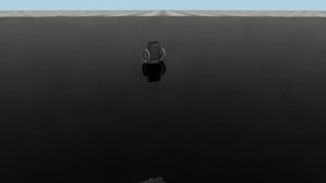
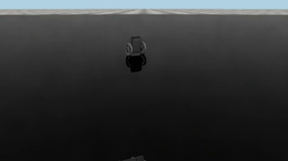

# 4. Training

Three tasks share one robot, one sensor model and one set of pushes. The RL policy is trained as a **cascade**: stage 1 learns to
hold a commanded lean, its weights are then **frozen**, and stage 2 learns to drive at a commanded speed by commanding lean to the
frozen stage 1. This mirrors the classical cascade (speed loop around a pitch loop) and lets each stage be small and quick to train.



## 4.1 The tasks

| Task | Goal | Policy input | Policy output | Trained |
|---|---|---|---|---|
| `BalanceCar-Upright-v0` | stay upright (baseline, exported for ROS) | pitch, pitch rate, wheel speeds, last action (6) | wheel torques (2) | on its own |
| `BalanceCar-Pitch-v0` | hold a commanded pitch ±0.08 rad, resampled every 0.5 to 1.5 s (0 in 20 % of the draws), flipped when the car is faster than 0.5 m/s | the 6 above + pitch target (7) | wheel torques (2) | stage 1 |
| `BalanceCar-Velocity-v0` | track a commanded forward speed ±0.4 m/s, resampled every 3 to 6 s (0 in 20 %) | pitch, pitch rate, forward speed from the encoders, speed target, last action (5) | pitch target (1) | stage 2, on the frozen stage 1 |

A pitch of 0.08 rad is about 0.8 m/s² of acceleration ([03-dynamics.md](03-dynamics.md) §3.2), and a lean cannot be held: it is a constant
acceleration and the wheels stop at 0.94 m/s (no load), so the pitch command is short and flips when the car is fast, like the output of a speed
controller. The speed range ±0.4 m/s is well inside what the robot can do. Every input is built from the raw IMU and the encoders ([02-sensing.md](02-sensing.md)); the simulator
state is used only by the rewards, the terminations and the evaluation.

## 4.2 Reward, per step

| Term | Upright | Pitch | Velocity |
|---|---|---|---|
| alive | +1 | +1 | +1 |
| fall (once, when the episode ends by falling) | -5 | -5 | -5 |
| upright: exp(-sin²(tilt) / 0.3²) | +2 | | +0.5 |
| pitch tracking: exp(-(pitch - target)² / 0.05²) | | +2 | |
| speed tracking: exp(-(v - target)² / 0.2²), v in the body frame | | | +2 |
| speed error, absolute (dense: the kernel above is flat far from the target) | | | -1 |
| roll and pitch rate, squared | -0.02 | -0.02 | -0.02 |
| wheel speed, squared | -0.001 | -0.002 | |
| action rate, squared change of action | -0.01 | -0.01 | -0.05 |

Isaac Lab multiplies every reward by the step time 0.02 s, so the largest episode return of the upright task is $(1+2)\cdot500\cdot0.02=30$,
and a fall costs $5\cdot0.02=0.1$ of it on top of the reward lost for the remaining steps. Code: `car/mdp/rewards.py`, the `*_env_cfg.py` files.

## 4.3 Episode

| Item | Value |
|---|---|
| Reset | pitch ±0.25 rad, yaw uniform, position ±0.1 m, root velocity ±0.1 m/s (x, y) and ±0.5 rad/s (about world y), wheel speed ±0.5 rad/s |
| Push | every 2 to 4 s, world-frame velocity **added** to the current one: x ±0.3 m/s, y ±0.1 m/s |
| Fall | tilt above 0.8 rad (a failure) |
| Time-out | 10 s = 500 policy steps (not a failure) |
| Timing | physics 200 Hz, policy 50 Hz |

Both events set the root velocity in the **world** frame (Isaac Lab's `reset_root_state_uniform` and `push_by_setting_velocity`).
With yaw randomized at every reset, "±0.5 rad/s about world y" is not a clean body-pitch-rate kick once the robot has yawed away
from zero, and the push's x/y is not the robot's own forward/lateral axis; the asymmetry (0.3 vs 0.1 m/s) is therefore a push of a
random size in a world-fixed, not body-fixed, direction. This has not been changed: it is still a reasonable disturbance and every
current policy was trained under it, but it is not what the axis names suggest.

## 4.4 PPO

$$L^{CLIP}=\mathbb E\Big[\min\big(\rho_t\hat A_t,\ \operatorname{clip}(\rho_t,1-\epsilon,1+\epsilon)\hat A_t\big)\Big],\quad
\rho_t=\frac{\pi_\theta(a_t|o_t)}{\pi_{\theta_{old}}(a_t|o_t)},\quad
\hat A_t=\sum_{l\ge0}(\gamma\lambda)^l\delta_{t+l},\ \ \delta_t=r_t+\gamma V(o_{t+1})-V(o_t)$$

| Setting | Upright, Pitch | Velocity |
|---|---|---|
| Network (actor and critic) | MLP 64-64, ELU | MLP 64-64, ELU |
| Initial action noise | 1.0 | 0.5 |
| Iterations | 300 | 500 |
| Common | 4096 environments, 24 steps each, 5 epochs, 4 minibatches, learning rate 1e-3 (adaptive, target KL 0.01), $\gamma=0.99$, $\lambda=0.95$, $\epsilon=0.2$, entropy 0.005, observation normalization |

Config: `car/rl_control/agents/rsl_rl_ppo_cfg.py`. About 3 to 6 minutes per stage on an RTX 3060 without video, about twice that with video.

## 4.5 Freezing a stage

A frozen stage is a TorchScript file with the observation normalization inside, run under `torch.inference_mode`; its weights never change.

```text
src/Balance_Car_RL/car/rl_control/frozen/<stage>/
    policy.pt      TorchScript actor, loaded by the next stage (mdp/actions.py::FrozenPitchAction)
    policy.onnx    the same network for ROS, one file
    meta.json      task, run folder, checkpoint, date, contract_sha256, evaluation numbers
```

`FrozenPitchAction` is the action term of stage 2. It scales the action to a pitch target (zeroing it instead, rather than flipping
its sign, if it would ask for more speed in a direction the car is already going faster than stage 1's own `speed_guard`
threshold — the input would otherwise be one stage 1 never trained on), rebuilds the 7-value input exactly as stage 1
saw it (`[pitch, pitch rate, left speed, right speed, previous inner action x2, pitch target]`, the IMU estimate being the one the
observation already computed this step), runs the frozen network, and applies the result to the wheels. Three things keep the stages
compatible, and tests check all three: the observation order of stage 1, the range and torque scale that stage 2 uses
(`tests/test_cascade.py`), and the `contract_sha256` in `meta.json` (a hash of the files that define stage 1's contract, checked
by `FrozenPitchAction` and by `train_cascade.py` before a later stage trains on a stale one — a printed warning, not a hard
stop, and only for stages frozen after this check was added). If a constant of `car_cfg.py`, `estimation.py` or
`mdp/observations.py` changes, stage 1 must be retrained and stage 2 after it; the hash only catches the files listed in
`mdp/actions.py::_CONTRACT_FILES`, not every possible cause.

## 4.6 Train everything: `scripts/train_cascade.py`

```bash
python scripts/train_cascade.py                   # pitch, then velocity
python scripts/train_cascade.py --stages pitch    # one stage; velocity needs pitch frozen first
python scripts/train_cascade.py --dry-run         # print the plan
```

For each stage, in order, stopping at the first failure:

| Step | What | Output |
|---|---|---|
| 1 train | `isaaclab train` with `--video`: a clip of 6 s every 2400 env steps | `logs/rsl_rl/<experiment>/<run>/`, clips in `videos/train/` |
| 2 play | `isaaclab play` on the last checkpoint: demo clip and export | `videos/play/`, `exported/policy.pt` and `policy.onnx` |
| 3 evaluate | `scripts/evaluate.py` on 256 environments against the stage's criteria | `eval.json` in the run folder |
| 4 freeze | copy the export to `rl_control/frozen/<stage>/` (only if step 3 passed) | `policy.pt`, `policy.onnx`, `meta.json` |
| 5 media | training curve, demo and training videos as mp4 and gif | `docs/media/<stage>_*.{png,mp4,gif}` |

Pass criteria: fall rate at most 2 %, and a **median** absolute tracking error of at most 0.03 rad (pitch) or 0.08 m/s (speed). The median is used because resets from a tilt of 0.25 rad, command steps (a step of 0.8 m/s takes about 1 s) and pushes give large but short errors that dominate an RMS; holding still would give a median of 0.03 rad and 0.13 m/s. The RMS, the RMS counted only after the transient, and the 90th percentile are printed too. A stage that fails
is not frozen and the later stages do not run. The logs of every step are in `logs/cascade/`. Video needs MoviePy 1.x
(`pip install "moviepy<2"`; the `moviepy.editor` API `scripts/train_cascade.py` uses was removed in MoviePy 2.x);
`--no-video` skips it for a quick test. `isaaclab train` returns exit code 0 even when it crashes, so the script checks for `Training time`.

By hand: `isaaclab train --rl_library rsl_rl --task BalanceCar-Pitch-v0 --num_envs 4096 --video`, and `isaaclab play ... --checkpoint <model.pt>`
to export. Headless is the default; add `--viz kit` to watch. Logs go to `./logs/rsl_rl/<experiment>` under the directory you run in.

## 4.7 Results

> **These numbers predate the code-review fixes below** (the filter no longer restarts from one raw accelerometer sample every
> episode, and `FrozenPitchAction` now guards its target against the speed the frozen stage never trained on). Both `frozen/pitch/`
> and `frozen/velocity/` were trained against the old behaviour and must be retrained: `python scripts/train_cascade.py`. This
> table (and the videos and training curves below it) stay as a record of the run that found and motivated those fixes, until the
> cascade is retrained and this section is refreshed from the new `meta.json` files.

Every stage is evaluated headless on 256 environments for 1500 policy steps (768 episodes, random start tilt, pushes, IMU noise) by
`scripts/evaluate.py`; the numbers below are the ones stored in `rl_control/frozen/<stage>/meta.json`.

| Stage | Task | Training | Falls | Median error | 90th percentile | RMS error | RMS after the transient |
|---|---|---|---|---|---|---|---|
| 1 | `BalanceCar-Pitch-v0` | 300 iterations, 6 min with video | 0.13 % | 0.017 rad | 0.065 rad | 0.053 rad | 0.039 rad |
| 2 | `BalanceCar-Velocity-v0` on the frozen stage 1 | 500 iterations, 10 min with video | 0 % | 0.038 m/s | 0.29 m/s | 0.164 m/s | 0.114 m/s |
| (baseline) | `BalanceCar-Upright-v0` | 300 iterations, 3 min | 0 % | | | | |

Reading the speed row: half of the time the speed is within 4 cm/s of the command, a tenth of the time it is more than 0.29 m/s off, which is the
size of a command step or of the recovery from the start tilt. Holding still would give a median of 0.13 m/s. The pitch estimate is off by
0.05 rad RMS in these runs.

| Media | |
|---|---|
| Training clips | [pitch](media/pitch_train.mp4), [velocity](media/velocity_train.mp4) |
| Frozen policies playing | [pitch](media/pitch_demo.mp4), [velocity](media/velocity_demo.mp4) |
| Training curves | [pitch](media/pitch_training_curve.png), [velocity](media/velocity_training_curve.png) |

 

**What went wrong on the way, and what was changed** (kept here because it explains the design):

- A first stage 1 asked for leans of 0.10 rad held for 2 to 4 s. A held lean is a constant acceleration, so the car ran into the top speed of the
  wheels (0.94 m/s) where the motors have no torque left, and 16 % of the episodes ended in a fall. Now the lean is at most 0.08 rad, changes every
  0.5 to 1.5 s, and is flipped when the car is already faster than 0.5 m/s ([mdp/commands.py](../src/Balance_Car_RL/car/mdp/commands.py)).
- Stage 2 first ignored large speed errors: the exponential reward is flat far from the target. A dense absolute-error term and a wider kernel fixed it.
- The pitch estimate was biased whenever the car accelerated (0.5 m/s² read as a 0.05 rad backward lean), which made the policy run away.
  The axle acceleration from the encoders is now removed from the accelerometer ([02-sensing.md](02-sensing.md) §2.2); the median speed error went from 0.052 to 0.038 m/s.
- The evaluation of the pass criteria stopped an RMS criterion from being meaningful (transients dominate it), so the median is used (§4.6).
- A code review (see the review document referenced from the repo root) found that `ImuPitchAndRate` was throwing away this exact
  seeded state one step later: at the first real IMU sample of every episode it discarded the filter and restarted from that one
  noisy, uncompensated sample, instead of continuing to filter from the true gravity direction `reset()` already knew. Both
  `frozen/pitch/` and `frozen/velocity/` were trained with that restart in place; it is now removed
  ([mdp/observations.py](../src/Balance_Car_RL/car/mdp/observations.py)), and both stages need retraining.
- The same review found that stage 2's action term could ask the frozen stage-1 policy for a lean in the same direction the car was
  already moving faster than 0.5 m/s -- exactly the input `speed_guard` keeps out of stage 1's own training. `FrozenPitchAction` now
  applies the same guard to the target it feeds the frozen policy.
- `train_cascade.py --reuse-latest` could freeze a stage from a leftover `eval.json` of a previous, unrelated run if the evaluation
  subprocess crashed on this run: it now deletes the file before evaluating, so only a fresh pass can freeze a stage.
