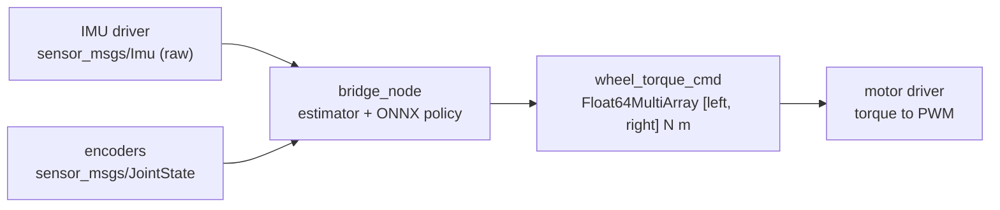

# 6. Deployment

A trained policy leaves Isaac Lab as an ONNX file and runs in a ROS 2 node. **This part is unit-tested, not yet run on the robot.**
Code: [ros/src/car_bridge](../ros/src/car_bridge).



## 6.1 Export

`isaaclab play` writes `exported/policy.pt` (TorchScript) and `policy.onnx` next to the checkpoint; the observation normalization is
inside the graph. `models/balance_car_policy.onnx` must be a single file, so any external `.data` file is embedded:

```python
import onnx
onnx.save_model(onnx.load("policy.onnx", load_external_data=True), "models/balance_car_policy.onnx", save_as_external_data=False)
```

`scripts/train_cascade.py` does this for every stage it freezes (`rl_control/frozen/<stage>/policy.onnx`).

## 6.2 The node

```bash
pip install onnxruntime                 # in the Python that ROS uses
cd ros && source /opt/ros/jazzy/setup.bash && colcon build --packages-select car_bridge
source install/setup.bash
ros2 run car_bridge bridge_node --ros-args -p policy_path:=$PWD/../models/balance_car_policy.onnx
```

| Topic | Type | Content |
|---|---|---|
| `imu` (in) | `sensor_msgs/Imu` | **raw** `angular_velocity` and `linear_acceleration` in the IMU frame; no orientation needed |
| `joint_states` (in) | `sensor_msgs/JointState` | `left_wheel_joint` and `right_wheel_joint` velocities [rad/s], relative to the body; also used to remove the robot's own acceleration from the accelerometer |
| `wheel_torque_cmd` (out) | `std_msgs/Float64MultiArray` | `[left, right]` torque [N m], clipped to the stall torque |

The node runs the acceleration compensation and the complementary filter of [02-sensing.md](02-sensing.md) (`estimator.py`) once per control step, so the pitch is defined
exactly as in training. Start it with the robot resting: the filter starts from the first accelerometer sample.

The ROS node currently loads the **upright** policy (6 inputs). Running the cascade (pitch policy under a velocity policy) needs a
second network and the pitch-target input; it is not done yet.

## 6.3 Checklist before the first real run

| Item | Why | Status |
|---|---|---|
| Weigh the robot and measure the COM ([01-robot.md](01-robot.md) §1.6) | The masses are estimates; the policy is trained on them | open |
| Check the IMU mounting: tilt 10° forward, pitch must read about +0.17 rad | A wrong axis or sign inverts the feedback | open |
| Torque command to motor PWM | The policy outputs N m; the driver takes PWM. Needs the motor constant and the supply voltage | open |
| Domain randomization (mass, friction, motor strength, latency) | Only IMU noise is randomized now | not implemented |
| Encoder noise, quantization and latency in simulation | Perfect in simulation | not implemented |
| Test with the wheels off the ground, then with a safety line | A wrong sign makes the robot run away | open |

## 6.4 Tests

`python -m pytest ros/src/car_bridge/test/test_policy.py ros/src/car_bridge/test/test_estimator.py` (with
`PYTHONPATH=ros/src/car_bridge`; the other files of that folder are the ament lint tests, they run under `colcon test`): the ONNX policy gives bounded torque and reacts to a lean; the estimator gives the right pitch at rest,
follows the gyro through a fast tilt and removes gyro drift. `tests/test_car_cfg.py` checks that the torque scale of the node equals the
one of the training config, and `tests/test_estimation.py` that the node's filter equals the simulation's.
